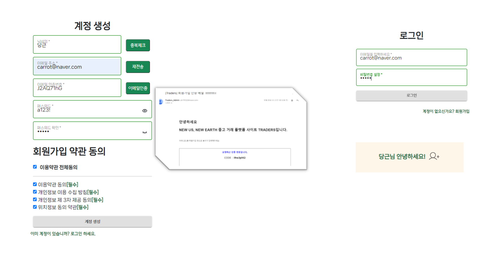
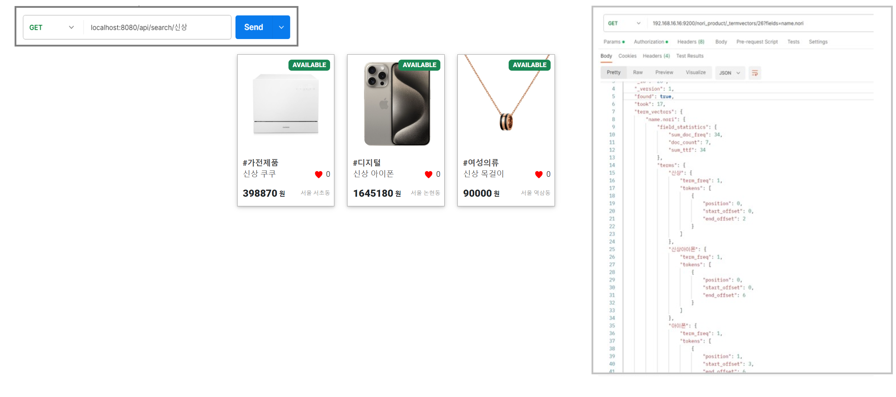
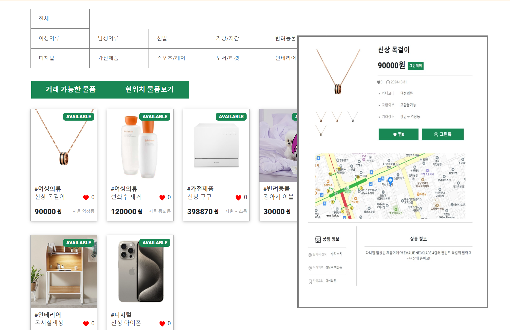
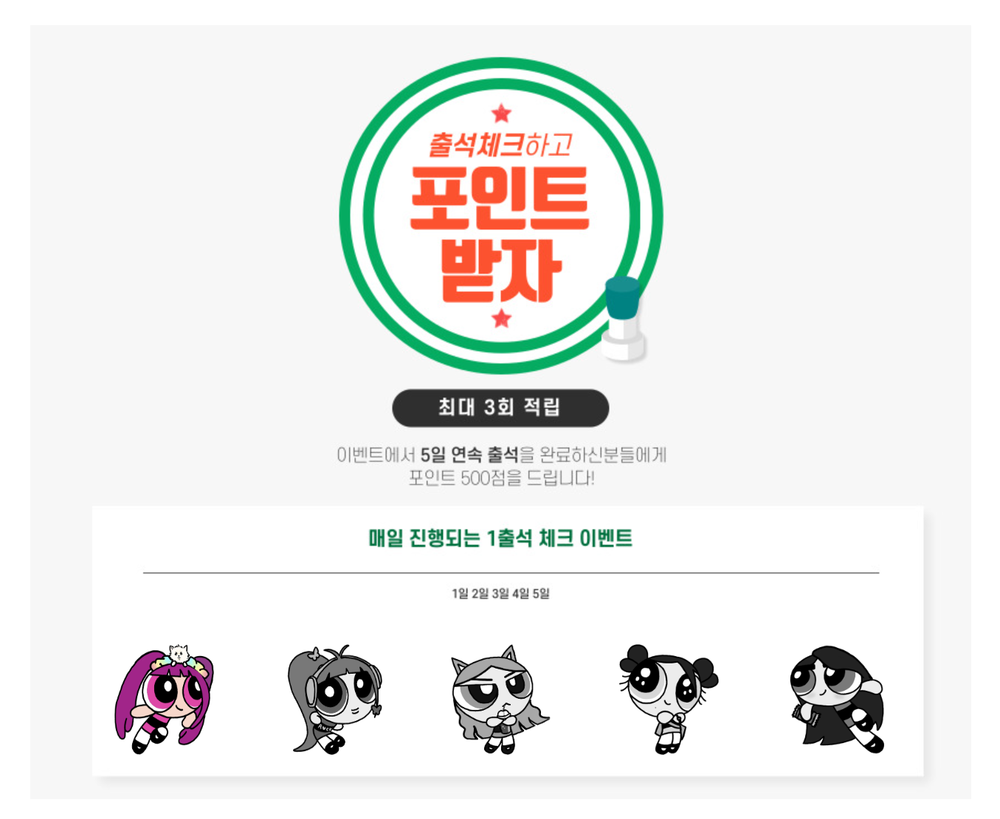

# 🍃 Traders, 기후 위기에 대응하고자 하는 마음이 행동으로 이어지도록
아이티윌 자바 핀테크 양성과정 파이널 프로젝트
 
 

## ✨ 프로젝트 소개
### New Earth, New Us, Traders
- Traders는 인근 지역 사람들 간의 직거래 활성화를 유도하는 **중고 거래 플랫폼** 사이트입니다.
- 유저 간 **실시간 채팅**을 통해 자원 순환형 환경친화적 거래 'ECO-TRADE'를 선도합니다.
- 온라인 거래 특성 상 발생하는 택배 거래에 수반되는 **불필요한 자원 낭비**를 **지양**하는 것을 목적으로 합니다.
 
 

## ⏰ 개발 기간
2023년 9월 7일 ~ 2023년 10월 31일(55일)
 
 

## 📚 기술 스택

 
 

## 📑 DB 구조
### 📃 Oracle

### 📃 MongoDB

 
 

## 🖥️ 핵심기능
### 📌 회원가입/로그인
- Spring Security + JWT 토큰을 이용한 회원가입 / 로그인 구현
- SMTP를 이용 이메일 인증번호 발송 기능 구현
- react hook form 이용 유효성 검사 구현
- interceptors 이용 자동 토큰 만료 상태 검사 및 Refresh 토큰 재발급 구현
- Redis에 Refresh 토큰 저장
  
### 📌 실시간 채팅
- SSE 서버로 실시간 채팅 메시지 구현
- MongoDB로 사용자 정보와 채팅 메시지 저장
- 카카오 지도 API 이용 맵 구현

### 📌 통합검색
- Logstash를 이용하여 Oracle DB와 연동
- Nori tokenizer 한글 형태소 분석기 사용
- ElasticSearch를 이용한 물품 검색 기능 구현

### 📌 물품
- JPA repository를 이용한 crud 구현
- 카카오 지도 API 이용 맵 구현

- Redis를 이용한 찜 기능 구현

### 📌 마이페이지
- 그린페이 충전 및 송금

- Redis를 이용한 출석체크 이벤트

- 내가 찜한 물품 조회
- 내가 등록한 물품 조회
 
 

## 👀 기술적 의사 결정
### ElasticSearch
기존 like로 검색을 하게 되면 쿼리 증가로 인한 사이트 속도 저하되는 단점이 있기 때문에 단어분석기를 이용하여 들어오는 데이터를 쪼개고 indexing 하여 기존 쿼리보다 더 빠른 속도로 데이터를 훑으며 정확한 검색 결과를 산출할 수 있기에 사용하였다.
### Redis
Refresh Token, 좋아요, 출석체크와 같이 빠른 속도로 데이터를 읽고, 빈번하게 수정을 해야하는 데이터를 저장하기 위해 사용하였다.
### jwt
보다 빠른 인증 처리와 추후에 사용자가 많아질 경우의 보안과 안정성을 위해 도입하였다.
### MongoDB
채팅은 비정형 데이터로 보다 효율적으로 저장하고 수시로 읽고 쓰기 기능이 요구되기 때문에 유연하고 속도가 빠른 MongoDB에 저장하였다. 또한 사용자가 많아질수록 채팅 데이터가 많이 축적되기 때문에 수평 확장성을 고려하여 NoSQL DB를 선택하였다.
 
 

## 👩‍💻 멤버 구성
| 이름            | 담당                       |
| -------------- | -------------------------- | 
| 이휘성(팀장)| 물품 CRUD / 통합검색 / 실시간 알림 / 찜 기능 / 출석체크 이벤트 BE / Refresh Token Redis 저장 / 랜덤 포인트 이벤트 BE|
| 강현슬| 실시간 채팅 / 출석체크 이벤트 FE / 카카오 지도 API 이용 맵 구현 / 웹 사이트 전체 및 상세 FE + CSS|
| 윤희라| 회원가입 및 로그인 / 마이페이지 / 랜덤 포인트 이벤트 FE / 웹 사이트 전체 및 상세 FE + CSS|
| 이아라| Mock Server 이용한 그린페이|
| 정예림| 캠페인|

